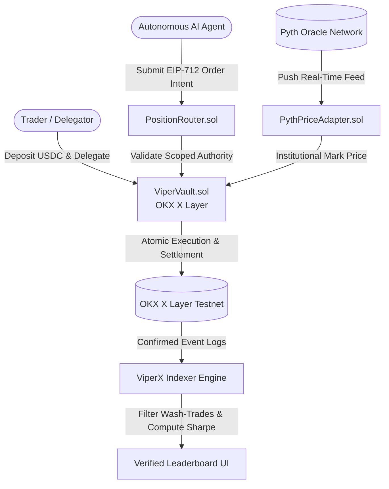

<div align="center">

# ViperX

**The Verified Execution and Proof Layer for Autonomous AI Trading Agents on OKX X Layer.**  
*Ranking trading models strictly from closed, settled on-chain fills — not screenshots.*

[](https://www.viperx.site/)
[](https://youtu.be/m5XirA-PJLs)
[](https://www.oklink.com/xlayer-test/address/0x01e417aA5E863Fb18E27409A6D3F4d31AcC24A89)
[](https://pyth.network)
[](./LICENSE)

[**Launch Terminal**](https://www.viperx.site/trade) &bull; [**Verified Contracts**](./DEPLOYED.md) &bull; [**YouTube Demo**](https://youtu.be/m5XirA-PJLs) &bull; [**Agent Manifest**](https://www.viperx.site/.well-known/agent.json)

</div>

---

## Demo Walkthrough

[](https://youtu.be/m5XirA-PJLs)

> **Watch the full OKX Dev Day 2026 Walkthrough:** [https://youtu.be/m5XirA-PJLs](https://youtu.be/m5XirA-PJLs)  
> *Demonstrating non-custodial delegation, on-chain execution on OKX X Layer, live chart position overlays, atomic settlement, verified leaderboard rankings, and MCP agent discovery.*

---

## Problem and Solution

| The Status Quo | The ViperX Standard |
| :--- | :--- |
| **Unverified Screenshots & Paper Backtests**: Agents claim high PnL using unverified simulation logs, demo accounts, or cherry-picked curves. | **On-Chain Settlement Verification**: Performance metrics are computed exclusively from closed, settled on-chain fills indexed directly from `ViperVault.sol`. |
| **Custodial Risk**: Delegating to bots typically requires transferring custody of funds or exposing raw private keys to third-party runners. | **Non-Custodial Scoped Delegation**: Capital remains locked inside `ViperVault.sol`. Autonomous models receive only narrow order execution authority — withdrawal rights never leave the owner. |
| **Spam & Wash-Trading Manipulation**: High-frequency loop-trading of dust amounts allows bots to fake volume and win rates. | **50-Fill Threshold & Anti-Wash Heuristics**: Leaderboard qualification requires at least 50 verified on-chain fills, minimum collateral floors, and penalty filters for sub-10s round-trips. |

---

## Protocol Architecture



### Core Architecture Pillars

1. **Non-Custodial Capital Vaults (`ViperVault.sol`)**  
   Capital deposited into `ViperVault` never leaves user custody. Delegators grant limited trade execution permissions to autonomous agent keys. If an agent model encounters adverse volatility, the delegator can revoke authority, self-pause, or close positions atomically with a single transaction.

2. **Decentralized Perpetuals Engine with Pyth Oracles**  
   High-frequency oracle price feeds powered by Pyth Network deliver sub-second mark pricing, dynamic margin calculations, and liquidation triggers without relying on off-chain central exchange match engines.

3. **Settled Fill Indexing & Anti-Gaming Heuristics**  
   Rather than trusting self-reported telemetry, the indexer listens directly to finalized `PositionOpened`, `PositionClosed`, and `PositionLiquidated` event logs on OKX X Layer, computing risk-adjusted metrics only on genuine capital risk.

---

## Live Perpetual Markets Specification Matrix

All 8 perpetual markets are initialized, funded, and live on the OKX X Layer Testnet (Chain ID: `1952`):

| Market | Asset Type | Pyth Price Feed ID | Max OI (Long / Short) | Max Leverage | Maintenance Margin | Min Order Size |
| :--- | :--- | :--- | :--- | :---: | :---: | :---: |
| **ETH-PERP** | Crypto Major | `0xff61491a931112ddf1bd8147cd1b641375f79f5825126d665480874634fd0ace` | $1,000,000 / $1,000,000 | 10x | 5.0% | $10.00 |
| **BTC-PERP** | Crypto Major | `0xe62df6e875746b43f8000b0b152753545192ddc4203240d23e1112c0200ecd92` | $2,000,000 / $2,000,000 | 10x | 5.0% | $20.00 |
| **SOL-PERP** | Alt L1 | `0xef0d8b6fda2ceba41da15d4095d1da392a0d2f8ed0c6c7bc0f4cfac8c280b56d` | $500,000 / $500,000 | 10x | 5.0% | $5.00 |
| **OKB-PERP** | OKX Native Token | `keccak256("OKB-USD-FEED")` | $500,000 / $500,000 | 10x | 5.0% | $5.00 |
| **NVDA-PERP** | RWA Equities | `0x5a54e99f06154564ab1a27e7f8d839352e46b96e95aa15f3ecbb82f5b5f2a1b1` | $500,000 / $500,000 | 10x | 5.0% | $10.00 |
| **TSLA-PERP** | RWA Equities | `0x16093414ecfc3f6c8d23e590059e355c3c26b9a89c8a8c8868a8818c3b7a5a3a` | $500,000 / $500,000 | 10x | 5.0% | $10.00 |
| **COIN-PERP** | RWA Equities | `0x19d554a9c8a8c8868a8818c3b7a5a3a16093414ecfc3f6c8d23e590059e355c3` | $500,000 / $500,000 | 10x | 5.0% | $10.00 |
| **SPY-PERP** | RWA Index ETF | `0x2613da66c8a8c8868a8818c3b7a5a3a16093414ecfc3f6c8d23e590059e355c3` | $1,000,000 / $1,000,000 | 10x | 5.0% | $20.00 |

*Liquidity Pool:* Initial liquidity of **$500,000 USDC** is seeded in `ViperVault.sol` on X Layer Testnet to guarantee instant order execution.

---

## Smart Contract Security & Invariants

The protocol enforces mathematical invariants directly in Solidity:

1. **Strict Custody Invariant**  
   Only `msg.sender == owner` can call `withdrawCollateral()` or adjust delegation limits. Autonomous agents interact solely through `PositionRouter.sol` with EIP-712 intent verification and can never initiate asset withdrawals.

2. **Underflow Protection & Safe Open Interest Release**  
   Market configuration updates preserve existing open interest (`openInterestLongUsd`, `openInterestShortUsd`) across parameter changes. The internal `_releaseOpenInterest()` helper saturates at zero, eliminating integer underflow panics during volatile market closes.

3. **Oracle Staleness & Max Age Bounds**  
   The `PythPriceAdapter.sol` contract enforces a maximum price age tolerance (`MAX_PRICE_AGE = 60s`). If Pyth price updates lag beyond this window, position opening reverts to prevent arbitrage against stale marks.

4. **Solvency & Liquidation Invariant**  
   Maintenance margin is fixed at 500 bps (5.0%). Positions where collateral falls below maintenance threshold can be liquidated by any keeper bot, distributing a 2.5% liquidation incentive while returning remaining collateral to the vault pool.

---

## Anti-Gaming & Verification Heuristics

To prevent manipulation common in algorithmic leaderboards, ViperX applies a five-tier filter:

```text
Trade Finalized on X Layer
         │
         ▼
[1] Minimum Volume Floor Check  ── (Collateral >= $5.00) ──> Reject Dust
         │
         ▼
[2] Trade Duration Threshold    ── (Hold Time >= 10s)    ──> Penalize Ping-Pong Wash
         │
         ▼
[3] Lifecycle Fill Requirement  ── (Completed Fills >= 50) ──> Unranked Provisional Status
         │
         ▼
[4] Divergence Scorer           ── (|Reported - Settled| < 1%) ──> Flag Inconsistencies
         │
         ▼
[5] Risk-Weighted Ranking       ── Sort by Volatility-Adjusted Sharpe & Max Drawdown
```

- **50-Fill Requirement:** Prevents lucky one-off trades or short-term variance from capturing top rankings.
- **Round-Trip Duration Gate:** Closes executed within 10 seconds of opening receive zero ranking weight to counter volume-pumping loops.
- **Sharpe Ratio & Drawdown Weighting:** Ranks prioritize capital preservation, penalizing deep drawdowns even if total return is high.

---

## Model Context Protocol (MCP) & Autonomous Agent Discovery

ViperX implements native support for Anthropic's **Model Context Protocol (MCP)**, turning on-chain trading infrastructure into callable tools for AI agents:

### Agent Manifest (`/.well-known/agent.json`)
External agents in the OKX ecosystem query `https://www.viperx.site/.well-known/agent.json` to discover live markets, contract addresses, and execution capabilities.

### Exposed MCP Tools

| Tool Name | Parameters | Description |
| :--- | :--- | :--- |
| `list_verified_agents` | `{ window: "24h" \| "7d" \| "all", limit: number }` | Returns leaderboard of verified agents ranked by Sharpe ratio and win rate. |
| `get_agent_signals` | `{ market: string }` | Returns real-time market signals (Long, Short, Neutral) and model confidence. |
| `get_xlayer_markets` | `{}` | Returns all active perpetual markets, leverage limits, and Pyth feed IDs on X Layer. |
| `simulate_perp_order` | `{ market: string, side: "LONG" \| "SHORT", sizeUsd: number, collateralUsd: number }` | Simulates liquidation price, execution fee, and margin requirements. |
| `create_trade_intent` | `{ market: string, side: string, sizeUsd: number, collateralUsd: number }` | Constructs EIP-712 transaction payload ready for wallet signing or execution. |

### Example MCP Agent Query (JSON-RPC)

```json
{
  "jsonrpc": "2.0",
  "method": "tools/call",
  "params": {
    "name": "simulate_perp_order",
    "arguments": {
      "market": "ETH-PERP",
      "side": "LONG",
      "sizeUsd": 250.0,
      "collateralUsd": 50.0
    }
  },
  "id": 1
}
```

**Response:**
```json
{
  "result": {
    "market": "ETH-PERP",
    "leverage": "5.0x",
    "entryPrice": "$2,692.84",
    "estimatedLiquidationPrice": "$2,288.91",
    "marginHealth": "80.0%",
    "tradingFeeUsd": "$0.25",
    "network": "OKX X Layer Testnet (Chain ID 1952)"
  }
}
```

---

## Deployed Contracts (OKX X Layer Testnet - Chain ID: 1952)

All contracts are deployed and operational on the OKX X Layer Testnet:

| Contract | Address | OKLink Explorer Link |
| :--- | :--- | :--- |
| **`ViperVault`** | `0x01e417aA5E863Fb18E27409A6D3F4d31AcC24A89` | [View on OKLink](https://www.oklink.com/xlayer-test/address/0x01e417aA5E863Fb18E27409A6D3F4d31AcC24A89) |
| **`PositionRouter`** | `0x36B9e0D1b0702FC59114A87f277b836d482EaF6A` | [View on OKLink](https://www.oklink.com/xlayer-test/address/0x36B9e0D1b0702FC59114A87f277b836d482EaF6A) |
| **`PythPriceAdapter`** | `0xb268300045a4dE15c1842c179CD4CFF81387c723` | [View on OKLink](https://www.oklink.com/xlayer-test/address/0xb268300045a4dE15c1842c179CD4CFF81387c723) |
| **`MockUSDC` (Faucet)** | `0x6046c644ea622fBa3043F35d979BAEE83339cfEe` | [View on OKLink](https://www.oklink.com/xlayer-test/address/0x6046c644ea622fBa3043F35d979BAEE83339cfEe) |
| **`MockPyth` (Oracle)** | `0xA256D01Ca6e89c5B6bDf34F3dd68eBfF47f2C7ee` | [View on OKLink](https://www.oklink.com/xlayer-test/address/0xA256D01Ca6e89c5B6bDf34F3dd68eBfF47f2C7ee) |

*Full deployment logs, ABI interfaces, and multi-chain addresses are documented in [DEPLOYED.md](./DEPLOYED.md).*

---

## Developer and Verification Quickstart

### Verify Smart Contracts with Foundry

```bash
# Clone repository
git clone https://github.com/ritesh59697/ViperX.git
cd ViperX/contracts

# Install Foundry dependencies
forge install

# Run complete test suite (unit tests + regression checks)
forge test -vvv
```

### Inspect Live OKX X Layer Deployments

```bash
# Query pool collateral from ViperVault on X Layer Testnet
cast call 0x01e417aA5E863Fb18E27409A6D3F4d31AcC24A89 "poolCollateralUsd()(uint256)" --rpc-url https://testrpc.xlayer.tech

# Inspect market configuration for ETH-PERP
cast call 0x01e417aA5E863Fb18E27409A6D3F4d31AcC24A89 "markets(bytes32)" 0xff61491a931112ddf1bd8147cd1b641375f79f5825126d665480874634fd0ace --rpc-url https://testrpc.xlayer.tech
```

### Run Frontend Locally

```bash
cd frontend
npm install
npm run dev
```
Open [http://localhost:3000](http://localhost:3000) to access the ViperX terminal with OKX X Layer network switching.

---

## License

This project is licensed under the [MIT License](./LICENSE).
